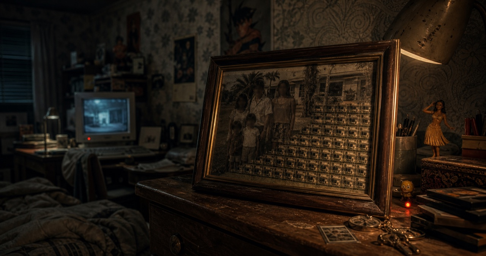

**English** · [Français](README.fr.md)

# stegg-lab

Artist research on steganography and media provenance for post-deepfake documentary cinema — using [stegg](https://ste.gg) (v3.0).



## What steganography is

**Hiding that information exists** — unlike encryption, which hides its content.

Combined, the two provide maximum security:
- Encryption → the message is unreadable even if found
- Steganography → nobody looks for the message

## Why this research

In a context where the documentary image is increasingly put in doubt (deepfakes, AI generation), steganography opens a path opposite to classic authentication: instead of only proving after the fact that an image hasn't been altered, one can inscribe into it, from the start, an invisible proof of provenance (signature, hash, context) that travels with the image without changing its appearance. This repository explores the technical methods (image, text) as material for this research, and as an artistic gesture in itself — see `art/README.md`.

## Installation

```bash
pip install stegg
```

## Available methods

### Image

| Method | Description | Survives JPEG compression? |
|---------|-------------|---------------------------|
| **LSB** | 1 bit per channel in the least significant bits | No |
| **F5** | JPEG DCT coefficients | Yes |
| **PVD** | Differences between pixel pairs | Partially |
| **CHROMA** | Cb/Cr color channels | No |
| **SPECTER** | Jump between RGB channels (key = pattern) | No |
| **MATRYOSHKA** | Images within images (up to 11 layers) | No |
| **GHOST MODE** | AES-256-GCM + LSB + decoy noise | No |

### Text (13 methods)

| Method | Principle |
|---------|----------|
| ZERO-WIDTH | Invisible characters between letters |
| INVISIBLE INK | Unicode Tag Characters (U+E0000) |
| HOMOGLYPHS | 'a' → Cyrillic 'а' (visually identical) |
| VARIATION SELECTORS | Invisible modifiers after characters |
| COMBINING MARKS | Invisible joiners |
| CONFUSABLE WHITESPACE | En-space/em-space/thin-space = bits |
| DIRECTIONAL OVERRIDES | Invisible bidi characters |
| HANGUL FILLER | Invisible Korean character |
| MATH BOLD | 'a' → '𝐚' (bold look, different encoding) |
| BRAILLE | Each byte = braille pattern |
| EMOJI SUBSTITUTION | 🔵=0, 🔴=1 |
| EMOJI SKIN TONE | 4 modifiers = 2 bits each |

## CLI usage

```bash
# Encode a message into an image
stegg encode-cmd --input image.png --message "secret" --output out.png

# Decode
stegg decode-cmd --input out.png

# Analyze an image (is it hiding something?)
stegg analyze --input image.png
```

## Python usage (API)

See `tools/` for ready-to-use scripts.

```python
from PIL import Image
from steg_core import encode, decode, StegConfig

# Encode
img = Image.open("carrier.png")
config = StegConfig()  # LSB RGB by default
result = encode(img, b"secret message", config, "output.png")

# Decode
decoded = decode(Image.open("output.png"))
print(decoded)
```

## Repo structure

```
stegg-lab/
├── docs/          # Method documentation
├── examples/      # Example files (not included in git)
├── tools/         # Python scripts
└── art/           # Artistic experiments
```

## Artistic projects

→ see `art/README.md`

By [Ismaël Joffroy Chandoutis](https://ismaeljoffroychandoutis.com).
